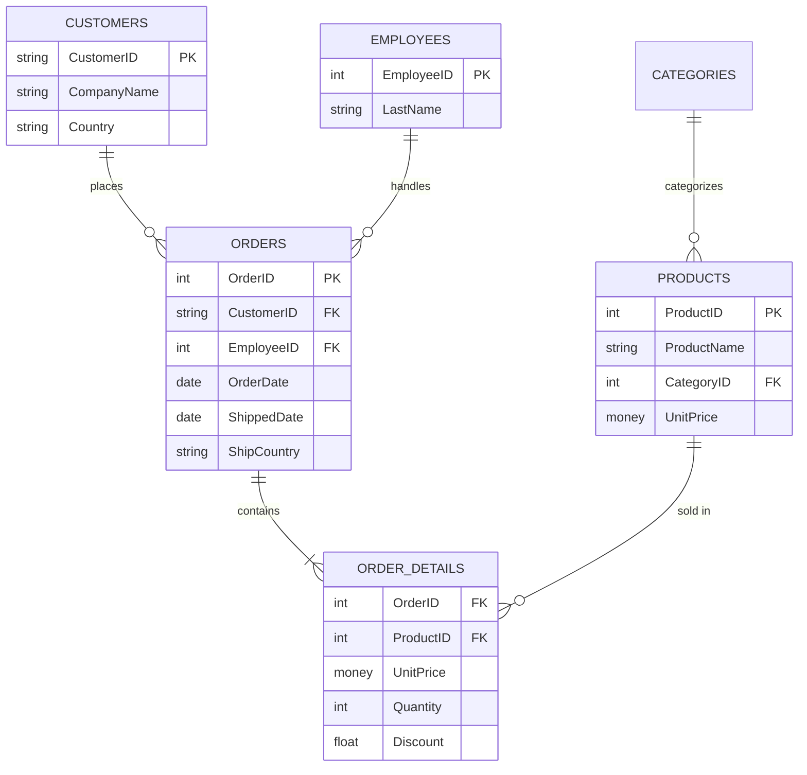
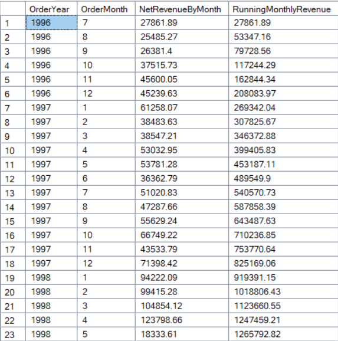
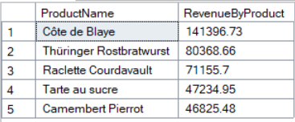
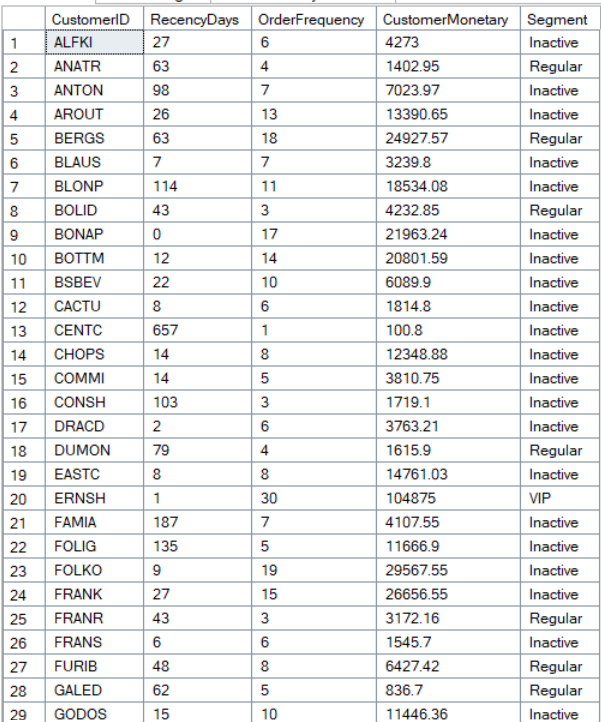
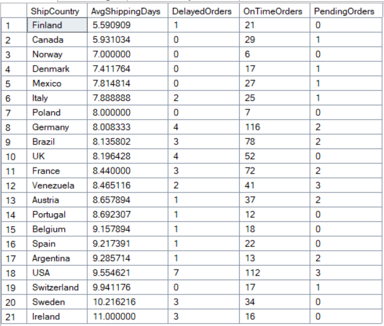

# Northwind SQL Analytics

End-to-end SQL analytics pipeline on the Northwind database using SQL Server/T-SQL. The project covers data profiling, cleaning, feature engineering, analytical data modeling, business analytics, advanced SQL analysis, and query performance optimization.

## Project Workflow

```text
Raw Northwind Tables
        ↓
Data Profiling
        ↓
Data Cleaning
        ↓
Feature Engineering
        ↓
FactSales
        ↓
Business Analytics
        ↓
Advanced SQL Analytics
        ↓
Performance Optimization
```

## Source Tables

| Table | Rows | Description |
|---|---:|---|
| Customers | 91 | Customer contact and location details |
| Orders | 830 | Order header info (dates, shipping, employee) |
| Order Details | 2,155 | Line items per order (product, qty, price, discount) |
| Products | 77 | Product catalog with pricing and stock levels |

Northwind is a small sample dataset — this table is for scale context, not a claim of production-scale data.

## Schema



`FactSales` (built in the pipeline) flattens this model into one row per `OrderID`-`ProductID` pair, joining all five tables together.

## Project Structure

```
├── README.md
└── Northwind_SQL_Analytics.sql
```

Run the script from top to bottom. Later sections depend on tables created earlier. Sections 4-8 can be re-run independently once `FactSales` exists.

## Data Quality Findings

| Table     | Column         | NULLs |
|-----------|----------------|------:|
| Orders    | ShippedDate    | 21    |
| Orders    | ShipPostalCode | 19    |
| Orders    | ShipRegion     | 507   |
| Customers | Region         | 60    |
| Customers | PostalCode     | 1     |
| Customers | Fax            | 22    |

## Null Handling Strategy

| Column | Treatment | Reason |
|---|---|---|
| `ShipRegion`, `Region` | Replaced with `'UNKNOWN'` | Many countries don't use a region field — not a data error |
| `ShipPostalCode`, `PostalCode` | Replaced with `'UNKNOWN'` | Small number of missing values; placeholder avoids breaking joins/filters |
| `Fax` | Replaced with `'Not Available'` | Not every customer has a fax number; distinguishes "no fax" from a missing record |
| `ShippedDate` | **Left as `NULL`** | A null here is meaningful — it means the order hasn't shipped yet. Replacing it would erase that signal. Used directly to derive `OrderStatus = 'Pending'` and to exclude unshipped orders from shipping-time calculations |

All replacements happen via `COALESCE()` in `02_data_cleaning.sql` while building `Clean_Orders` / `Clean_Customers` — one pass, no separate `UPDATE` afterward.

## FactSales

`FactSales` is the analytical fact table created from the cleaned Northwind data.

**Grain:** one row per `OrderID`-`ProductID` combination.

**Derived columns:** `GrossRevenue`, `DiscountAmount`, `NetRevenue`, `OrderYear`, `OrderMonth`, `OrderDay`, `WeekdayOrderDate`, `OrderStatus`, `ShippingDays`

## Key Business Questions

- How is revenue changing over time?
- Which products and categories generate the most revenue?
- Who are the highest-value customers, and how do they segment (VIP, regular, inactive)?
- How many customers are new versus returning?
- Which countries have the highest shipping delay rates?
- Which employees generate the highest sales?
- Which small set of products drives 80% of total revenue (Pareto)?
- Which products are frequently purchased together?

## Performance Optimization

- Clustered indexes created on key columns with supporting nonclustered indexes where appropriate
- Derived columns calculated during `SELECT INTO` instead of separate `ALTER`/`UPDATE` passes
- Repeated scalar subqueries replaced with window functions where appropriate
- Order-level shipping analysis performed using `Clean_Orders` instead of repeatedly deduplicating `FactSales`
- Shared aggregations calculated once using a temporary table
- Cleaning and fact-table creation sections drop existing target tables, making the script re-runnable

Northwind is small enough (see Source Tables above) that these optimizations don't produce a measurable difference here — they reflect patterns (indexing, single-pass aggregation, avoiding redundant scans) that matter significantly at production scale on larger tables.

## Sample Results

### Monthly Revenue Trend


Revenue trended [upward/downward/seasonally] across the dataset, with the highest month at [$X] in [Month Year] and the lowest at [$X] in [Month Year].

### Top 5 Products by Revenue


[Product Name] is the single highest revenue driver at [$X], accounting for roughly [X]% of total revenue on its own — well ahead of the next closest product.

### Customer RFM Segmentation


Of [X] customers analyzed, [X] fell into the VIP segment (recent, frequent, high-spend), while [X] were flagged Inactive — customers with no recent orders who may need re-engagement.

### Country-Wise Shipping Performance


[Country Name] had the highest average shipping delay at [X] days, while [Country Name] shipped fastest at [X] days on average — a gap worth investigating from a logistics standpoint.

## Tech Stack

SQL Server (T-SQL)

## SQL Concepts Used

CTEs, window functions, conditional aggregation, ranking functions, self-joins, temporary tables, indexing, data cleaning, feature engineering, and query optimization.
